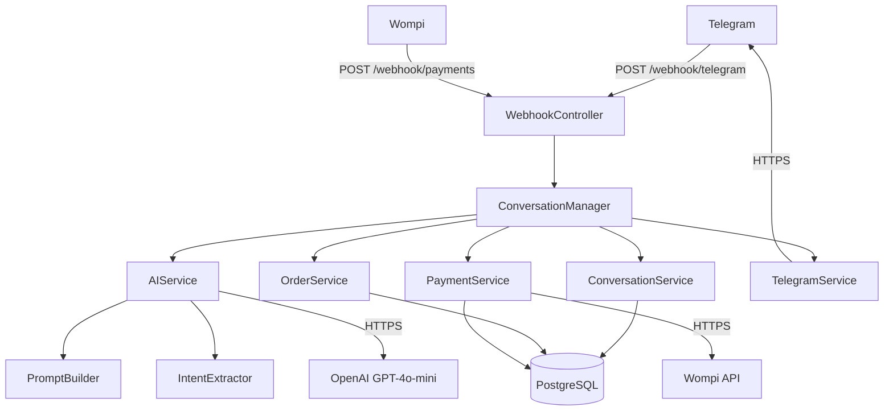
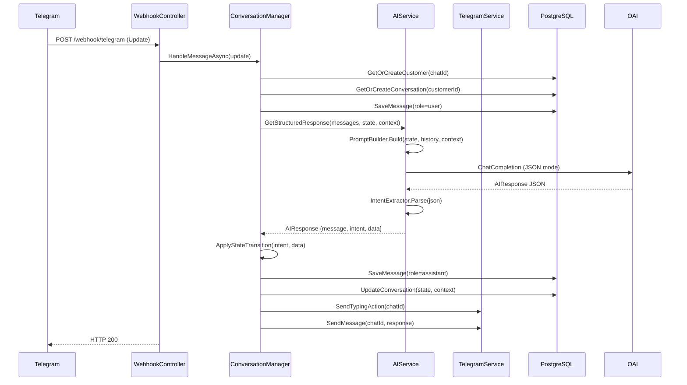
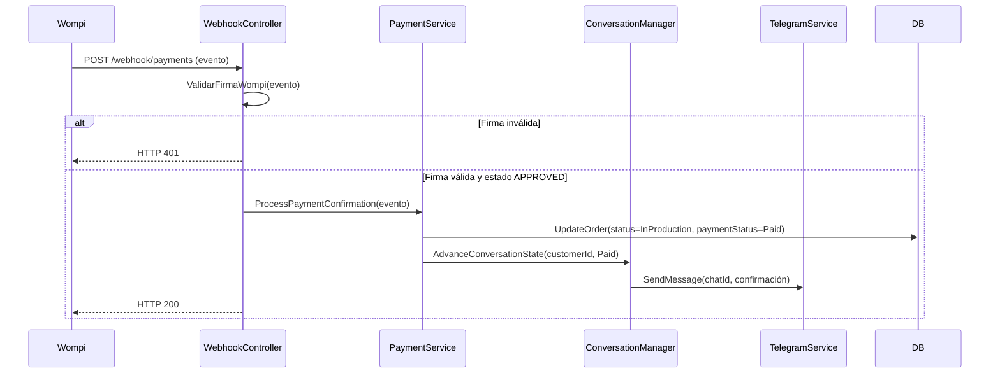
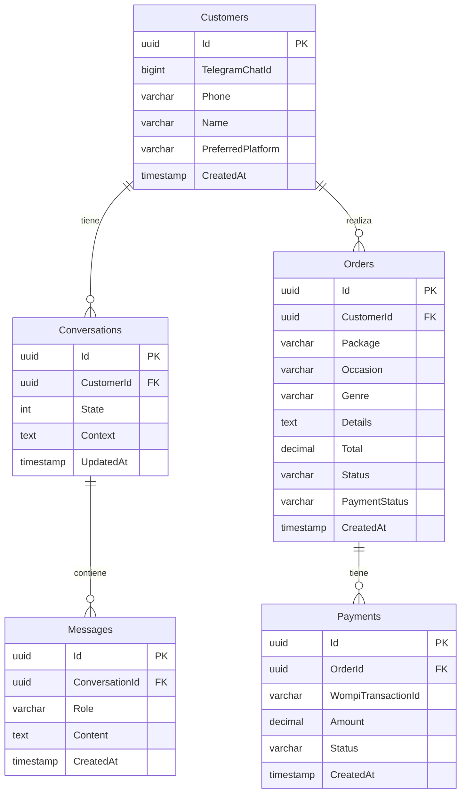

# Design Document — Celeste Conversational Agent

## Overview

Celeste es el agente conversacional de LetraViva: guía a los clientes desde el primer mensaje en Telegram hasta el pago de una canción personalizada. El backend es ASP.NET Core (.NET 8) con PostgreSQL, desplegado en Railway.

El MVP valida si los usuarios compran canciones personalizadas a través de un chat. El flujo completo es:

```
Telegram → POST /webhook/telegram → ConversationManager → OpenAI GPT-4o-mini → Tools Layer → PostgreSQL
                                                                                              ↓
                                                                                    Wompi (pagos)
```

### Objetivos de diseño

- **Flujo guiado por estados**: cada conversación avanza por un conjunto finito de estados (`ConversationState`), lo que hace el comportamiento predecible y testeable.
- **IA como intérprete, no como orquestador**: OpenAI interpreta la intención del usuario y genera la respuesta con personalidad, pero el `ConversationManager` es quien decide las transiciones de estado.
- **Respuesta HTTP 200 siempre**: el webhook de Telegram debe responder 200 en todos los casos para evitar reintentos.
- **Observabilidad desde el inicio**: cada procesamiento de webhook registra `TelegramChatId`, `ConversationState` y texto del mensaje.

---

## Architecture

### Diagrama de componentes



### Flujo de un mensaje entrante



### Flujo de confirmación de pago



---

## Components and Interfaces

### WebhookController

Punto de entrada HTTP. Recibe updates de Telegram y eventos de Wompi.

```csharp
[ApiController]
public class WebhookController : ControllerBase
{
    // POST /webhook/telegram
    Task<IActionResult> ReceiveTelegram([FromBody] Update update);

    // POST /webhook/payments
    Task<IActionResult> ReceivePayment([FromBody] WompiEvent wompiEvent);
}
```

**Responsabilidades:**
- Extraer `TelegramChatId` del update; retornar 200 sin procesar si no está disponible.
- Delegar todo el procesamiento al `ConversationManager`.
- Capturar excepciones no controladas, registrar stack trace y retornar 200.
- Validar firma de Wompi antes de procesar el evento de pago.

---

### ConversationManager

Orquestador central. Coordina todos los servicios y aplica las transiciones de estado.

```csharp
public interface IConversationManager
{
    Task HandleMessageAsync(Update update);
    Task AdvanceConversationStateAsync(Guid customerId, ConversationState newState);
}
```

**Responsabilidades:**
- Registrar log de entrada: `TelegramChatId`, `ConversationState`, texto del mensaje.
- Llamar a `ConversationService` para obtener/crear cliente y conversación.
- Llamar a `AIService` para obtener `AIResponse`.
- Aplicar la transición de estado según `intent` y `ConversationState` actual.
- Llamar a `OrderService` cuando corresponda crear o actualizar un pedido.
- Llamar a `PaymentService` cuando el estado transiciona a `AwaitingPayment`.
- Llamar a `TelegramService` para enviar la respuesta.

**Tabla de transiciones de estado:**

| Estado actual       | Intent / Condición              | Estado siguiente    | Acción adicional                        |
|---------------------|---------------------------------|---------------------|-----------------------------------------|
| `Idle`              | cualquier mensaje               | `DiscoveringOccasion` | —                                     |
| `DiscoveringOccasion` | ocasión detectada             | `ChoosingPackage`   | Guardar ocasión en Context              |
| `ChoosingPackage`   | paquete válido seleccionado     | `CollectingDetails` | Guardar paquete en Context              |
| `CollectingDetails` | detalles completos              | `AwaitingPayment`   | Crear Order, generar enlace Wompi       |
| `AwaitingPayment`   | `intent = payment_question`     | `AwaitingPayment`   | Responder sobre métodos de pago         |
| `Paid`              | confirmación de pago (Wompi)    | `InProduction`      | Notificar al usuario                    |
| `InProduction`      | cualquier mensaje               | `InProduction`      | Informar que la canción está en proceso |
| `Delivered`         | cualquier mensaje               | `Delivered`         | Ofrecer nuevo pedido                    |
| cualquiera          | `intent = ask_price`            | sin cambio          | Responder con lista de paquetes         |
| cualquiera          | `intent = ask_delivery`         | sin cambio          | Responder con tiempos de entrega        |
| cualquiera          | mensaje fuera de flujo          | sin cambio          | Mensaje de orientación                  |

---

### ConversationService

Acceso a datos para clientes, conversaciones y mensajes.

```csharp
public interface IConversationService
{
    Task<Customer> GetOrCreateCustomerAsync(long telegramChatId, string? name);
    Task<Conversation> GetOrCreateConversationAsync(Guid customerId);
    Task SaveMessageAsync(Guid conversationId, string role, string content);
    Task UpdateConversationStateAsync(Guid conversationId, ConversationState state, string? contextJson);
    Task<IReadOnlyList<Message>> GetRecentMessagesAsync(Guid conversationId, int count = 10);
}
```

---

### AIService

Integración con OpenAI. Construye el prompt, llama a la API y parsea la respuesta.

```csharp
public interface IAIService
{
    Task<AIResponse> GetStructuredResponseAsync(
        IReadOnlyList<Message> history,
        ConversationState currentState,
        string? contextJson,
        string userMessage);
}
```

**Responsabilidades:**
- Usar `PromptBuilder` para construir el system prompt.
- Llamar a OpenAI GPT-4o-mini en modo JSON (`response_format: { type: "json_object" }`).
- Usar `IntentExtractor` para parsear la respuesta.
- En caso de fallo (timeout, error de red), retornar `AIResponse` con `intent = "other"` y mensaje de fallback en español.

---

### PromptBuilder

Construye el system prompt para OpenAI.

```csharp
public static class PromptBuilder
{
    public static string Build(
        ConversationState state,
        IReadOnlyList<Message> recentMessages,
        string? contextJson);
}
```

El prompt incluye:
1. **Personalidad de Celeste**: cálida, creativa, colombiana, usa emojis con moderación.
2. **Reglas de negocio**: paquetes, precios, tiempos de entrega.
3. **Estado actual** de la conversación (`ConversationState`).
4. **Contexto acumulado** (ocasión, paquete, detalles ya recolectados).
5. **Instrucción de formato**: responder siempre con JSON `{ "message": "...", "intent": "...", "data": {} }`.
6. **Intents válidos**: `create_order`, `ask_price`, `ask_delivery`, `payment_question`, `other`.

---

### IntentExtractor

Parsea la respuesta JSON de OpenAI.

```csharp
public static class IntentExtractor
{
    public static AIResponse Parse(string rawJson);
}
```

- Si el JSON es válido y contiene los campos requeridos, retorna el `AIResponse` completo.
- Si el JSON no es válido, retorna `AIResponse { intent = "other", message = rawJson, data = null }`.

---

### OrderService

Gestión de pedidos.

```csharp
public interface IOrderService
{
    Task<Order> CreateOrderAsync(Guid customerId, string package, string occasion,
                                  string genre, string details);
    Task<Order> GetOrderAsync(Guid orderId);
    Task UpdateOrderStatusAsync(Guid orderId, string status, string paymentStatus);
}
```

**Catálogo de paquetes y precios:**

| Paquete   | Precio (COP) | Tiempo de entrega |
|-----------|-------------|-------------------|
| Básico    | $99.900     | 5 días hábiles    |
| Estándar  | $149.900    | 3 días hábiles    |
| Premium   | $199.900    | 1 día hábil       |

Si el paquete no existe en el catálogo, lanza `ArgumentException` con mensaje descriptivo.

---

### PaymentService

Integración con Wompi.

```csharp
public interface IPaymentService
{
    Task<string> GeneratePaymentLinkAsync(Guid orderId, decimal amount);
    Task<PaymentResult> ProcessWebhookAsync(WompiEvent wompiEvent);
}
```

- Lee `WOMPI_PUBLIC_KEY` y `WOMPI_PRIVATE_KEY` desde variables de entorno.
- Genera el enlace de pago usando el `orderId` como referencia única.
- Valida la firma del evento con `WOMPI_EVENTS_SECRET` (HMAC-SHA256).
- En caso de fallo, registra el error con `orderId` y retorna `PaymentResult.Failure` sin lanzar excepción.

---

### TelegramService

Envío de mensajes a Telegram.

```csharp
public interface ITelegramService
{
    Task SendTypingActionAsync(long chatId);
    Task SendMessageAsync(long chatId, string text);
}
```

- Lee `TELEGRAM_BOT_TOKEN` desde variables de entorno.
- Envía `SendChatAction(typing)` antes de cada mensaje.
- En caso de fallo, registra el error en logs y no lanza excepción.

---

## Data Models

### Entidades existentes (con cambios requeridos)

#### Customer

```csharp
public class Customer
{
    public Guid Id { get; set; }
    public long TelegramChatId { get; set; }      // bigint NOT NULL
    public string? Phone { get; set; }
    public string? Name { get; set; }
    public string? PreferredPlatform { get; set; }
    public DateTime CreatedAt { get; set; } = DateTime.UtcNow;

    public ICollection<Conversation> Conversations { get; set; }
    public ICollection<Order> Orders { get; set; }
}
```

#### Conversation

```csharp
public class Conversation
{
    public Guid Id { get; set; }
    public Guid CustomerId { get; set; }
    public Customer Customer { get; set; } = null!;
    public ConversationState State { get; set; } = ConversationState.Idle;
    public string? Context { get; set; }           // JSON: { occasion, package, genre, details, orderId }
    public DateTime UpdatedAt { get; set; } = DateTime.UtcNow;
    public ICollection<Message> Messages { get; set; }
}
```

#### Message

```csharp
public class Message
{
    public Guid Id { get; set; }
    public Guid ConversationId { get; set; }
    public Conversation Conversation { get; set; } = null!;
    public string Role { get; set; } = string.Empty;   // "user" | "assistant"
    public string Content { get; set; } = string.Empty;
    public DateTime CreatedAt { get; set; } = DateTime.UtcNow;
}
```

#### Order

```csharp
public class Order
{
    public Guid Id { get; set; }
    public Guid CustomerId { get; set; }
    public Customer Customer { get; set; } = null!;
    public string Package { get; set; } = string.Empty;   // "Básico" | "Estándar" | "Premium"
    public string? Occasion { get; set; }
    public string? Genre { get; set; }
    public string? Details { get; set; }
    public decimal Total { get; set; }
    public string Status { get; set; } = "Pending";        // "Pending" | "InProduction" | "Delivered"
    public string PaymentStatus { get; set; } = "Pending"; // "Pending" | "Paid"
    public DateTime CreatedAt { get; set; } = DateTime.UtcNow;
}
```

### Entidades nuevas

#### Payment (nueva tabla)

```csharp
public class Payment
{
    public Guid Id { get; set; }
    public Guid OrderId { get; set; }
    public Order Order { get; set; } = null!;
    public string WompiTransactionId { get; set; } = string.Empty;
    public decimal Amount { get; set; }
    public string Status { get; set; } = string.Empty;    // "APPROVED" | "DECLINED" | "VOIDED"
    public DateTime CreatedAt { get; set; } = DateTime.UtcNow;
}
```

### DTOs

#### AIResponse

```csharp
public record AIResponse(
    string Message,
    string Intent,
    JsonElement? Data
);
```

#### WompiEvent

```csharp
public record WompiEvent(
    string Event,
    WompiEventData Data,
    string Signature,
    long Timestamp
);

public record WompiEventData(
    WompiTransaction Transaction
);

public record WompiTransaction(
    string Id,
    string Reference,
    string Status,
    decimal AmountInCents
);
```

#### PaymentResult

```csharp
public record PaymentResult(bool Success, string? ErrorMessage = null)
{
    public static PaymentResult Ok() => new(true);
    public static PaymentResult Failure(string error) => new(false, error);
}
```

### Esquema de base de datos (PostgreSQL)



### AppDbContext (cambios requeridos)

```csharp
public class AppDbContext : DbContext
{
    public DbSet<Customer> Customers => Set<Customer>();
    public DbSet<Conversation> Conversations => Set<Conversation>();
    public DbSet<Message> Messages => Set<Message>();
    public DbSet<Order> Orders => Set<Order>();
    public DbSet<Payment> Payments => Set<Payment>();  // NUEVO
}
```

---

## Correctness Properties

*Una propiedad es una característica o comportamiento que debe cumplirse en todas las ejecuciones válidas del sistema — esencialmente, una afirmación formal sobre lo que el sistema debe hacer. Las propiedades sirven como puente entre las especificaciones legibles por humanos y las garantías de corrección verificables por máquinas.*

---

### Property 1: GetOrCreateCustomer es idempotente

*Para cualquier* `TelegramChatId` válido, llamar a `GetOrCreateCustomerAsync` dos o más veces con el mismo id debe retornar siempre el mismo cliente (mismo `Id` de base de datos), sin crear duplicados.

**Validates: Requirements 1.1**

---

### Property 2: GetOrCreateConversation es idempotente

*Para cualquier* `CustomerId` válido, llamar a `GetOrCreateConversationAsync` dos o más veces debe retornar siempre la misma conversación (mismo `Id`), sin crear duplicados.

**Validates: Requirements 1.2**

---

### Property 3: Nombre del cliente se persiste correctamente

*Para cualquier* nombre de usuario no nulo y no vacío, al crear un cliente con ese nombre, el campo `Customer.Name` almacenado en la base de datos debe ser igual al nombre proporcionado.

**Validates: Requirements 1.4**

---

### Property 4: Estado Idle transiciona a DiscoveringOccasion con cualquier mensaje

*Para cualquier* mensaje de usuario (string no vacío) recibido cuando el `ConversationState` es `Idle`, el estado resultante de la conversación debe ser `DiscoveringOccasion`.

**Validates: Requirements 2.1**

---

### Property 5: Ocasión se guarda en Context y avanza el estado

*Para cualquier* string de ocasión válido recibido cuando el `ConversationState` es `DiscoveringOccasion`, el estado resultante debe ser `ChoosingPackage` y el campo `Context` de la conversación debe contener la ocasión proporcionada.

**Validates: Requirements 2.2**

---

### Property 6: Detalles completos crean Order y avanzan a AwaitingPayment

*Para cualquier* combinación válida de detalles (nombre del destinatario, género musical, mensaje especial) recibida cuando el `ConversationState` es `CollectingDetails`, debe crearse un `Order` en la base de datos y el estado resultante debe ser `AwaitingPayment`.

**Validates: Requirements 2.4**

---

### Property 7: Mensaje fuera de flujo produce respuesta de orientación

*Para cualquier* mensaje de usuario que no corresponda al paso esperado del flujo en el estado actual, la respuesta de Celeste debe ser un string no vacío que oriente al usuario sobre qué información se espera.

**Validates: Requirements 2.9**

---

### Property 8: Round-trip de creación y consulta de Order preserva todos los campos

*Para cualquier* combinación válida de datos de pedido (Package del catálogo, Occasion, Genre, Details), crear un `Order` con `CreateOrderAsync` y luego obtenerlo con `GetOrderAsync` debe retornar un objeto con todos los campos iguales a los proporcionados, y el `Total` debe corresponder exactamente al precio del paquete en el catálogo.

**Validates: Requirements 4.1, 4.2, 4.5**

---

### Property 9: Package inválido lanza excepción de validación

*Para cualquier* string que no sea `"Básico"`, `"Estándar"` o `"Premium"`, llamar a `CreateOrderAsync` con ese paquete debe lanzar una `ArgumentException` con un mensaje descriptivo.

**Validates: Requirements 4.6**

---

### Property 10: PromptBuilder incluye todos los elementos requeridos

*Para cualquier* combinación de `ConversationState`, historial de mensajes (lista de 0 a 10 mensajes) y contexto JSON, el prompt construido por `PromptBuilder.Build` debe contener: la personalidad de Celeste, las reglas de negocio (paquetes y precios), el estado actual de la conversación, y el contenido de los mensajes del historial.

**Validates: Requirements 5.2**

---

### Property 11: Round-trip del parser JSON de AIResponse

*Para cualquier* `AIResponse` válido (con `message`, `intent` y `data` arbitrarios), serializar el objeto a JSON y luego parsearlo con `IntentExtractor.Parse` debe producir un `AIResponse` equivalente con los mismos valores en todos los campos.

**Validates: Requirements 5.4, 5.10**

---

### Property 12: JSON inválido produce AIResponse con intent="other"

*Para cualquier* string que no sea JSON válido o que no contenga los campos requeridos, `IntentExtractor.Parse` debe retornar un `AIResponse` con `intent = "other"` y el texto crudo en el campo `message`.

**Validates: Requirements 5.9**

---

### Property 13: Fallo de OpenAI produce AIResponse de fallback

*Para cualquier* tipo de excepción lanzada por el cliente de OpenAI (timeout, error de red, error de autenticación), `AIService.GetStructuredResponseAsync` debe retornar un `AIResponse` con `intent = "other"` y un mensaje de fallback no vacío en español, sin propagar la excepción.

**Validates: Requirements 8.2**

---

### Property 14: Enlace de pago contiene el orderId como referencia

*Para cualquier* `orderId` (GUID) y monto válido, el enlace de pago generado por `PaymentService.GeneratePaymentLinkAsync` debe contener el `orderId` como referencia única en la URL o parámetros del enlace.

**Validates: Requirements 6.1**

---

### Property 15: Firma inválida de Wompi retorna HTTP 401

*Para cualquier* evento de Wompi cuya firma no coincida con la calculada usando `WOMPI_EVENTS_SECRET`, el `WebhookController` debe retornar HTTP 401 y no procesar el evento.

**Validates: Requirements 6.3, 6.5**

---

### Property 16: orderId inexistente en evento Wompi no lanza excepción

*Para cualquier* GUID que no corresponda a ningún `Order` existente en la base de datos, `PaymentService.ProcessWebhookAsync` debe completar sin lanzar excepción y retornar `PaymentResult.Failure`.

**Validates: Requirements 6.6**

---

### Property 17: Fallo de Wompi retorna PaymentResult.Failure sin excepción

*Para cualquier* tipo de excepción lanzada por el cliente HTTP de Wompi, `PaymentService` debe retornar `PaymentResult.Failure` con un mensaje de error descriptivo, sin propagar la excepción al caller.

**Validates: Requirements 8.3**

---

### Property 18: WebhookController retorna HTTP 200 ante cualquier error interno

*Para cualquier* tipo de excepción lanzada por el `ConversationManager` durante el procesamiento de un update de Telegram, el `WebhookController` debe capturarla, registrar el stack trace en los logs y retornar HTTP 200.

**Validates: Requirements 3.5, 8.1**

---

### Property 19: Log de entrada contiene chatId, estado y texto del mensaje

*Para cualquier* mensaje de Telegram entrante con `TelegramChatId`, `ConversationState` y texto válidos, el sistema debe registrar en los logs los tres valores al inicio del procesamiento del webhook.

**Validates: Requirements 8.4**

---

## Error Handling

### Estrategia general

El sistema sigue el principio de **fail-safe**: ante cualquier error, el webhook de Telegram siempre retorna HTTP 200 para evitar reintentos. Los errores se registran con contexto suficiente para diagnóstico.

### Errores por capa

| Capa | Tipo de error | Comportamiento |
|------|--------------|----------------|
| `WebhookController` | Excepción no controlada | Log del stack trace + HTTP 200 |
| `WebhookController` | Update sin `TelegramChatId` | HTTP 200 sin procesar |
| `WebhookController` | Firma Wompi inválida | HTTP 401 + log del intento |
| `AIService` | Timeout / error de red con OpenAI | Log del error + `AIResponse { intent="other", message=fallback }` |
| `AIService` | Respuesta no parseable como JSON | `AIResponse { intent="other", message=rawText }` |
| `PaymentService` | Error al llamar a Wompi | Log con `orderId` + `PaymentResult.Failure` |
| `PaymentService` | `orderId` no encontrado | Log del error + retorno sin excepción |
| `TelegramService` | Error al enviar mensaje | Log del error + no relanzar excepción |
| `OrderService` | Package inválido | `ArgumentException` con mensaje descriptivo |

### Logging

Cada procesamiento de webhook registra al inicio:
```
[INFO] Webhook recibido | ChatId: {telegramChatId} | State: {conversationState} | Message: {userMessage}
```

Los errores registran:
```
[ERROR] {Componente} | ChatId: {telegramChatId} | OrderId: {orderId?} | Exception: {stackTrace}
```

---

## Testing Strategy

### Enfoque dual

Se usa una combinación de **tests de ejemplo** (para comportamientos específicos y casos de integración) y **tests basados en propiedades** (para verificar invariantes universales).

### Property-Based Testing

Se usa **FsCheck** (biblioteca de PBT para .NET/C#) para implementar los tests de propiedades.

- Cada test de propiedad se ejecuta con un mínimo de **100 iteraciones**.
- Los servicios externos (OpenAI, Wompi, Telegram, PostgreSQL) se mockean con **Moq** para mantener los tests rápidos y deterministas.
- Cada test referencia la propiedad del documento de diseño con el tag:
  `// Feature: celeste-conversational-agent, Property {N}: {descripción}`

**Propiedades a implementar como tests PBT** (ver sección Correctness Properties):
- Property 1: Idempotencia de GetOrCreateCustomer
- Property 2: Idempotencia de GetOrCreateConversation
- Property 3: Persistencia del nombre del cliente
- Property 4: Transición Idle → DiscoveringOccasion
- Property 5: Transición DiscoveringOccasion → ChoosingPackage con Context
- Property 6: Transición CollectingDetails → AwaitingPayment con Order creado
- Property 7: Mensaje fuera de flujo → orientación
- Property 8: Round-trip crear/obtener Order con campos correctos
- Property 9: Package inválido → ArgumentException
- Property 10: PromptBuilder incluye todos los elementos
- Property 11: Round-trip del parser JSON de AIResponse
- Property 12: JSON inválido → intent="other"
- Property 13: Fallo OpenAI → AIResponse de fallback
- Property 14: Enlace de pago contiene orderId
- Property 15: Firma Wompi inválida → HTTP 401
- Property 16: orderId inexistente → no excepción
- Property 17: Fallo Wompi → PaymentResult.Failure
- Property 18: WebhookController → HTTP 200 ante cualquier error
- Property 19: Log contiene chatId, estado y texto

### Tests de ejemplo (xUnit)

Se usan para:
- Comportamientos específicos de estados concretos (Paid, InProduction, Delivered)
- Intents específicos (ask_price, ask_delivery, payment_question, create_order)
- Confirmación de pago Wompi (evento APPROVED)
- Verificación de configuración (lectura de variables de entorno)
- Tests de integración con base de datos en memoria (EF Core InMemory)

### Tests de smoke

- Verificar que la migración de base de datos aplica sin errores
- Verificar que las tablas y columnas requeridas existen
- Verificar que `AppDbContext` expone `DbSet<Payment>`

### Estructura de proyecto de tests

```
ApiLetraViva.Tests/
├── Unit/
│   ├── Services/
│   │   ├── ConversationServiceTests.cs
│   │   ├── AIServiceTests.cs
│   │   ├── OrderServiceTests.cs
│   │   ├── PaymentServiceTests.cs
│   │   └── TelegramServiceTests.cs
│   ├── Components/
│   │   ├── PromptBuilderTests.cs
│   │   └── IntentExtractorTests.cs
│   └── Controllers/
│       └── WebhookControllerTests.cs
├── Properties/
│   ├── ConversationServicePropertyTests.cs
│   ├── OrderServicePropertyTests.cs
│   ├── IntentExtractorPropertyTests.cs
│   ├── PaymentServicePropertyTests.cs
│   └── WebhookControllerPropertyTests.cs
└── Smoke/
    └── DatabaseMigrationTests.cs
```

### Dependencias de test

```xml
<PackageReference Include="xunit" Version="2.9.0" />
<PackageReference Include="xunit.runner.visualstudio" Version="2.8.2" />
<PackageReference Include="FsCheck.Xunit" Version="2.16.6" />
<PackageReference Include="Moq" Version="4.20.72" />
<PackageReference Include="Microsoft.EntityFrameworkCore.InMemory" Version="8.0.0" />
<PackageReference Include="Microsoft.AspNetCore.Mvc.Testing" Version="8.0.0" />
```
